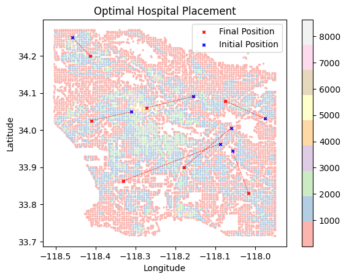
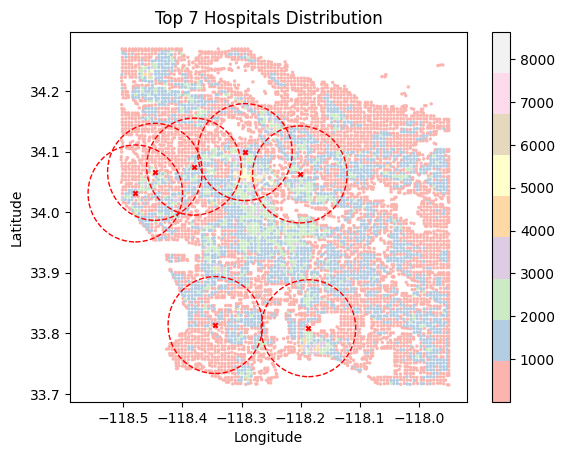

<h1>Hospital Distribution</h1>

This project aims to minimize the distance people have to travel to get to a hospital.

<em>A plot of optimal hospital locations. The blue stars represent the initial position of the hospitals, and the red stars represent the locations after SGD optimization.</em>

### Inspiration
Getting to the hospital is a matter of life or death. Optimally placing hospitals 

### Dataset
The population density map of LA is from Meta's Data for Good team, which can be found [here](https://dataforgood.facebook.com/dfg/tools/high-resolution-population-density-maps). The data was obtained using satellite images and census data. 

### Approach
- We start by randomly placing n hospitals on the city's map

- Then we find the distance between a density point and its nearest hospital

- Apply the sigmoid function to each minimum distance to calculate loss
- Apply the SGD loss minimization step to calculate new hospital locations
- Do this for 100 epochs

### Results

<em>The image shows the initial and final positions of the hospitals. The red circles are used to calculate coverage, the number of people inside the radius of at least one hospital divided by the total number of people</em>
 
**coverage** is defined as the number of people inside the radius of at least one hospital divided by the total number of people. With our method, using 7 hospitals results in an coverage of 64%. 
 
We compare this to the coverage obtained by the top 7 hospitals in the LA county, which only has an coverage of 41%

*Top* hospitals according to [US News](https://health.usnews.com/best-hospitals/area/los-angeles-ca). Although the coverage is lower, it is not easy to conclude which distribution is better for reasons explained in the future work section.

### Future Work
#### Account for Hospital Max Occupancy
With the current method, each hospital can theoreticaly serve an infinite amount of people, but this is not realistic. Hospitals have limits as to how many people they can serve.
#### Account for cost of Travel
The cost of travel is different for each person, whether that is time or money. For example, someone who owns a car and can take time off from work can easily get to the hospital. Someone who does not own a car and cannot take time off from work cannot get to the hospital as easily. 
#### Account for Traffic Routes
Traffic affects the time it takes to get to a hospital

### Try it Out
Check out the Google Colab [here](https://colab.research.google.com/drive/1NaczA0OB5WlobMhQ0ZK-92yGP_6CpvaW#scrollTo=FDhwSLKhV1BS)
