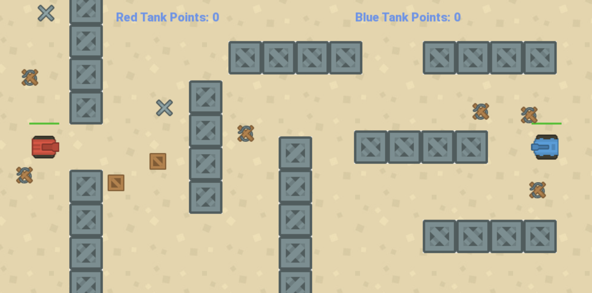

**Tanky:**  An exhilarating two-player tank battle game with a physics engine, set in an environment full of obstacles.

### How it was Built
The Physics Engine was built in C as part of the CS 3 class @ Caltech, as a collaboration with Luke Kottom, Samuel Foxman, and Matthew Casertano. We implemented forces, collisions, shapes, and more from scratch.

### Challenges

### What I learned

Play the game [here](https://xmb5.github.io/tanky/tanky.html)

**Controls**
* Red Tank: WASD, E to shoot
* Blue Tank: Arrow Keys, / to shoot
* U to reset